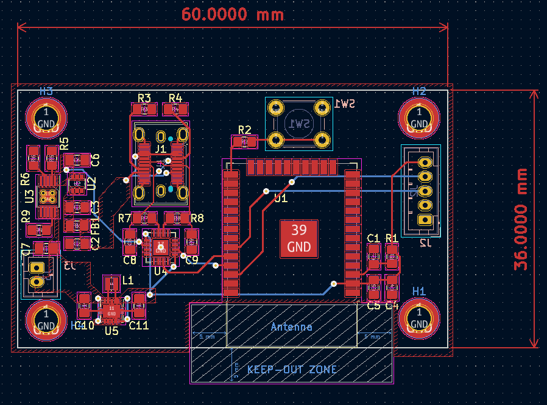
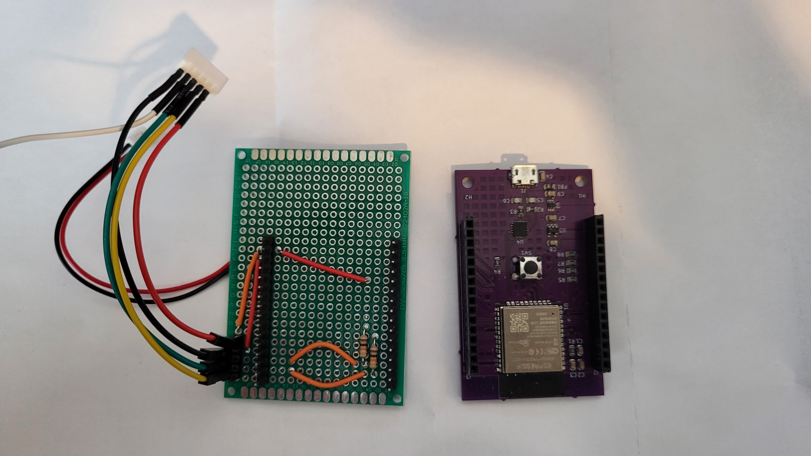
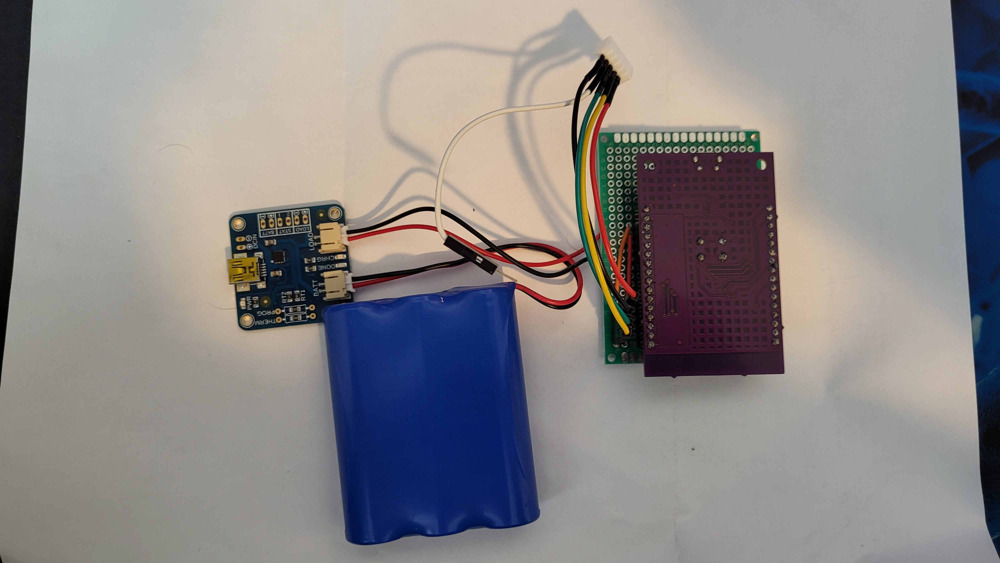

# HID Guitar Controller - Converting a Wii Guitar into a Windows Compatible HID Device

## Table of Contents

- [Description](#description)
- [Design](#design)
- [Current State](#current-state-of-the-project)
- [What would I do differently? What changes would I make?](#what-would-i-do-differently-what-changes-would-i-make)
- [Installation](#installation) <!-- Should I have Installation and Usage above or below the Design, Current State, Changes, etc? -->
- [Usage](#usage)
- [Credits](#credits)
- [License](#license)

## Description

This project aims to create a device that will take the data from a Wii Guitar Extension Controller and transmit that data to a computer as an HID Device. 

I am a fan of Guitar Hero and rhythm games in general. Guitar Hero was the first rhythm game I ever played and I played it on the Wii using the extension device that came with the game. I long sold the Wii, but I found out that there was a PC version of Guitar Hero called Clone Hero. Since I still had the extension device so I looked into connecting a Wii Remote to a windows computer. While you are able to connect a Wii controller via bluetooth to a Windows Computer it requires the use of third party uncertified drivers. This requires certain settings to turned off in Windows, such as test-signing. The downside of this is that it triggers anti-cheat softwares in competitive video games such as Valorant, making you unable to play those games with the settings turned off. Since these settings require a Computer Restart everytime they are changed, it makes it tedious to switch between games. 

Since I am an electrical engineering major, I decided to make a device that will practically replace the Wii Remote and be able to read the controller inputs from the Wii Guitar Extension Controller and interface with windows as an HID device. I also wanted to make this a battery-powered bluetooth device to remove any cables while using the controller. 

## Design

A lot of information exists on how the Wii works including how the Wii Remote communicates with extension devices such as the Nunchuk or the Wii Guitar. The communication protocol used is a 3.3V I2C signal(s) with nearly all extension devices having an address of 0x52. By default, the data is encrypted but more ‘modern’ extension devices, such as the Wii Guitar, can be set in a decrypted communication mode using the following I2C sequence:

Start, 0xF0, 0x55, Stop, Start, 0xFB, 0x00, Stop

The data is formatted into 6 bytes with the following bit structure with the default bit value being 1 for all of the buttons, changing to 0 when the button is pressed:

SX and SY refer to the x and y-axis of the analog stick. 
WB refers to the analog whammy bar. 
BD and BU refer to the strum bar. 
BO, BR, BB, BG, and BY refer to the Fretbuttons.
B- and B+ are the final two buttons on the 
TB refer to the analog touch bar which is only found on some Wii Guitars

The block diagram above shows the basic outline for the circuit that will take in the data from the Wii Guitar and output via Bluetooth. The necessary power systems for battery power are also included. 

The ESP32, specifically the ESP32-WROOM-32D module, was chosen for the microcontroller because of its inbuilt Bluetooth Low Energy (BLE) Capability as well as my prior experience with designing custom boards for it from my Senior Design Class. My previous design already had the USB Controller (USB-to-UART Converter) and the ESP32, so the only thing that needed to be added was a Battery Management System (BMS) and a 3.3V Regulator. While the old 3.3V regulator Circuit would have worked, I did not know that at the time so I used TI’s WeBench to make a circuit capable of inputting 3.5V-5V and outputting a stable 5V. The circuit that was recommended used the TPS63001. The BQ24090 was chosen for the BMS circuit as one of the guides that I found used that IC for their own custom microcontroller. Another circuit that was added to the schematic was a reverse current protection circuit using the LM66100.

I chose to use a Vertical USB-C connector for two reasons. One is because USB-C is becoming much more common. The second reason is so that in the future, I can attach the board to a piece of acrylic and have the connector flush or near flush with the acrylic once the board is mounted. This idea of mounting is also why I have the programming button and JST connectors (for the battery and connection to the Wii Guitar) on the bottom of the board. Since the USB-C connector is an SMD component, I decided to have all of the SMD components on the same side, but in order for the USB-C to be placed correctly, I needed the other connectors to sit on the other side. Since this was being assembled by hand having all the SMD components on the same side would make it easier to assemble. 

Three libraries are needed to program the board. The first is the Wire library which is needed to communicate with the Wii Guitar via I2C. The second library is LemmingDev’s ESP32-BLE-Gamepad library. This library makes it very easy to turn an ESP32 into a BLE Gamepad that can connect and send data to the computer. The final library that is needed is a dependence for the ESP32-BLE-Gamepad, the NimBLE-Arduino Library. 

## Current State of the Project

Between running a DRC Check and ordering the PCB, a 3.3V via was moved so that it intersectedthe GND Plane. I attempted to cut the via out of the 3.3V circuit an replace the trace with a wire, but I did not have the correct equipement to do it properly. Thus I have yet to test this specific design. I did have a battery charge module from Adafruit, as well as an ESP32 Microcontroller that I had designed previously (which has the same basic microcontoller circuitry that this design had) so I was able to test the code for functionality. The KiCAD files have been updated, and I plan to add a couple of features before repurchasing the board. 

## What would I do differently? What changes would I make?

With this project being under a time limit, one of the things I would do differently is how I managed the project and my time. I would allocate specific times throughout my week and days to work on my project. This will allow me to make better progress throught the entire project timeline, giving me more time to catch errors such as the misplaced via that ultimately made the PCB I initially purchased unuseable. I would also allocate time to work on documentation during the developement of the project so that it is more than just an afterthought at the end of the project. 

I would also spend more time learning how Battery Management IC and systems work as they are a very important part to many modern systems and understanding how to work with them will be beneficial in the future, for both personal and professional projects. 

For future versions of this project, I would like to add the following:
- Whammy Bar Support
- Guitar Tilt Support (This is typically handled by the Wii Remote so accelerameters need to be added to the device)
- The creation of a mounting plate/enclosure for the device that fits into the Wii Remote slot on the Guitar
- Ability to connect to the device via USB or BLE without reuploading the code

A reach idea that I had would be to add audio support to this device. Being able to send audio information via the USB or BLE Connections and outputing that audio via connector on the guitar, which I would have to add. This would require the addition of a DAC and AMP to be integrated into the device. Ideally, the audio connection would be the same as the controller connection, but early version may have them separated. Before attempting to implement this idea into this project, I would make a project involving the creation of a custom Bluetooth DAC/AMP Device. 

## Installation

What additional EDA libraries and files are needed for this project?
- 

What code libraries and files are needed for this project?
- The Arduino [Wire](https://www.arduino.cc/reference/en/language/functions/communication/wire/) Library
- LemmingDev’s [ESP32-BLE-Gamepad](https://github.com/lemmingDev/ESP32-BLE-Gamepad) Library
- H2zero's [NimBLE-Arduino](https://github.com/h2zero/NimBLE-Arduino/releases/tag/1.4.1) Library

<!--

## Usage

## Features

If your project has a lot of features, list them here.

## Tests

-->

## Credits

Third-Part assests used in this project:
- Code Libraries
  - LemmingDev’s [ESP32-BLE-Gamepad](https://github.com/lemmingDev/ESP32-BLE-Gamepad) Library
  - H2zero's [NimBLE-Arduino](https://github.com/h2zero/NimBLE-Arduino/releases/tag/1.4.1) Library
- 

If you followed tutorials, include links to those here as well.
- 

## License

Licensed under the [CERN-OHL-S-2.0](LICENSE.txt) License